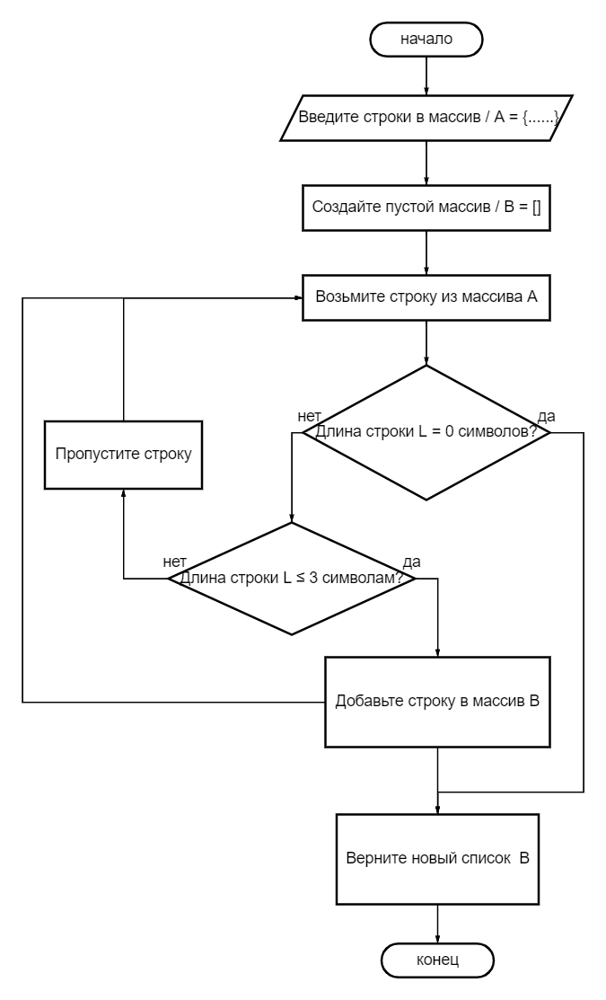

Задача алгоритмически не самая сложная, однако для полноценного выполнения проверочной работы необходимо:

1. Создать репозиторий на GitHub
2. Нарисовать блок-схему алгоритма (можно обойтись блок-схемой основной содержательной части, если вы выделяете её в отдельный метод)
3. Снабдить репозиторий оформленным текстовым описанием решения (файл README.md)
4. Написать программу, решающую поставленную задачу
5. Использовать контроль версий в работе над этим небольшим проектом (не должно быть так, что всё залито одним коммитом, как минимум этапы 2, 3, и 4 должны быть расположены в разных коммитах)

Задача: Написать программу, которая из имеющегося массива строк формирует новый массив из строк, длина которых меньше, либо равна 3 символам. Первоначальный массив можно ввести с клавиатуры, либо задать на старте выполнения алгоритма. При решении не рекомендуется пользоваться коллекциями, лучше обойтись исключительно массивами.

### Решение 

# 1. Создал репозиторий на Github - https://github.com/Klivy86/Test_on_the_main_block.git
# 2. Нарисовал и добавил блок-схему решения задачи 

# 3. Снабдил репозиторий оформленным тестовым описанием решения (файл READMY.md)
1) Создайте новый пустой список, который мы будем использовать для хранения отфильтрованных строк.
2) Пройдите по каждой строке в вашем исходном списке:
- Возьмите одну строку из исходного списка.
- Проверьте длину этой строки:
  - Если она меньше или равна 3 символам, добавьте эту строку в наш новый список.
  - Если она больше 3 символов, пропустите эту строку и перейдите к следующей.
3) Когда вы пройдете через все строки в исходном списке, у вас будет новый список, содержащий только те строки, которые имеют длину меньше или равную 3 символам.
4) Верните этот новый список с отфильтрованными строками.
# 4. Написал программу решающую задачу :Program.cs
# 5. Использоваk контроль версий в работе над этим небольшим проектом